# AVA Dashboard - Use Case Diagram

```plantuml
@startuml Use Case Diagram - AVA Dashboard

!theme amiga

left to right direction

actor "Guest User" as Guest
actor "Customer" as Customer
actor "Vendor" as Vendor
actor "Admin" as Admin
actor "Payment Gateway" as PaymentGW
actor "Email Service" as EmailSvc

rectangle "AVA Dashboard E-commerce Platform" {
  
  package "Authentication & User Management" {
    usecase "Register Account" as UC1
    usecase "Login" as UC2
    usecase "Verify Email/OTP" as UC3
    usecase "Reset Password" as UC4
    usecase "Manage Profile" as UC5
    usecase "Change Password" as UC6
  }
  
  package "Product Management" {
    usecase "Browse Products" as UC7
    usecase "Search Products" as UC8
    usecase "View Product Details" as UC9
    usecase "Add Product" as UC10
    usecase "Edit Product" as UC11
    usecase "Delete Product" as UC12
    usecase "Manage Categories" as UC13
    usecase "Manage Sub-categories" as UC14
  }
  
  package "Shopping & Cart" {
    usecase "Add to Cart" as UC15
    usecase "View Cart" as UC16
    usecase "Update Cart Items" as UC17
    usecase "Remove from Cart" as UC18
    usecase "Add to Wishlist" as UC19
    usecase "Manage Wishlist" as UC20
  }
  
  package "Order Management" {
    usecase "Place Order" as UC21
    usecase "Guest Checkout" as UC22
    usecase "View Orders" as UC23
    usecase "Track Order" as UC24
    usecase "Cancel Order" as UC25
    usecase "Return Order" as UC26
    usecase "Process Orders" as UC27
  }
  
  package "Payment & Billing" {
    usecase "Process Payment" as UC28
    usecase "Create Payment Intent" as UC29
    usecase "Handle Payment Status" as UC30
    usecase "Issue Refund" as UC31
  }
  
  package "Shipping & Logistics" {
    usecase "Manage Shipments" as UC32
    usecase "Track Shipments" as UC33
    usecase "Update Delivery Status" as UC34
  }
  
  package "Reviews & Ratings" {
    usecase "Write Product Review" as UC35
    usecase "Rate Product" as UC36
    usecase "View Reviews" as UC37
    usecase "Moderate Reviews" as UC38
  }
  
  package "Content Management" {
    usecase "View Terms & Conditions" as UC39
    usecase "View About Us" as UC40
    usecase "Subscribe to Newsletter" as UC41
    usecase "Manage Coupons" as UC42
  }
  
  package "Analytics & Reporting" {
    usecase "View Sales Reports" as UC43
    usecase "Monitor User Activity" as UC44
    usecase "Track Inventory" as UC45
  }
}

' Guest User relationships
Guest --> UC1
Guest --> UC2
Guest --> UC7
Guest --> UC8
Guest --> UC9
Guest --> UC15
Guest --> UC16
Guest --> UC22
Guest --> UC37
Guest --> UC39
Guest --> UC40
Guest --> UC41

' Customer relationships
Customer --> UC2
Customer --> UC3
Customer --> UC4
Customer --> UC5
Customer --> UC6
Customer --> UC7
Customer --> UC8
Customer --> UC9
Customer --> UC15
Customer --> UC16
Customer --> UC17
Customer --> UC18
Customer --> UC19
Customer --> UC20
Customer --> UC21
Customer --> UC23
Customer --> UC24
Customer --> UC25
Customer --> UC26
Customer --> UC35
Customer --> UC36
Customer --> UC37

' Vendor relationships
Vendor --> UC2
Vendor --> UC5
Vendor --> UC6
Vendor --> UC10
Vendor --> UC11
Vendor --> UC12
Vendor --> UC23
Vendor --> UC27
Vendor --> UC43
Vendor --> UC45

' Admin relationships
Admin --> UC2
Admin --> UC5
Admin --> UC6
Admin --> UC10
Admin --> UC11
Admin --> UC12
Admin --> UC13
Admin --> UC14
Admin --> UC23
Admin --> UC27
Admin --> UC32
Admin --> UC33
Admin --> UC34
Admin --> UC38
Admin --> UC42
Admin --> UC43
Admin --> UC44
Admin --> UC45

' External system relationships
UC28 --> PaymentGW : processes payment
UC29 --> PaymentGW : creates intent
UC3 --> EmailSvc : sends verification
UC4 --> EmailSvc : sends reset link
UC41 --> EmailSvc : sends newsletter

' Include relationships
UC21 ..> UC28 : <<include>>
UC22 ..> UC28 : <<include>>
UC27 ..> UC32 : <<include>>
UC24 ..> UC33 : <<include>>

' Extend relationships
UC1 ..> UC3 : <<extend>>
UC4 ..> UC3 : <<extend>>
UC21 ..> UC19 : <<extend>>
UC26 ..> UC31 : <<extend>>

@enduml
```

## Use Case Descriptions

### Primary Actors:
- **Guest User**: Non-registered visitors who can browse and purchase
- **Customer**: Registered users with full shopping capabilities
- **Vendor**: Users who can sell products on the platform
- **Admin**: System administrators with full management access

### Secondary Actors:
- **Payment Gateway**: External payment processing service (Stripe)
- **Email Service**: External email service for notifications

### Key Use Case Categories:

1. **Authentication & User Management**: User registration, login, profile management
2. **Product Management**: Product CRUD operations, category management
3. **Shopping & Cart**: Shopping cart and wishlist functionality
4. **Order Management**: Order processing, tracking, and status updates
5. **Payment & Billing**: Payment processing and financial transactions
6. **Shipping & Logistics**: Shipment tracking and delivery management
7. **Reviews & Ratings**: Product review and rating system
8. **Content Management**: Static content and promotional features
9. **Analytics & Reporting**: Business intelligence and monitoring

### Business Rules:
- Guests can browse and purchase but need to provide email for order tracking
- Customers have persistent carts and wishlists across sessions
- Vendors can only manage their own products
- Admins have full system access and can manage all entities
- All orders require payment processing before fulfillment
- Email verification is required for account activation

This use case diagram represents the complete functional scope of the AVA Dashboard e-commerce platform based on the codebase analysis.